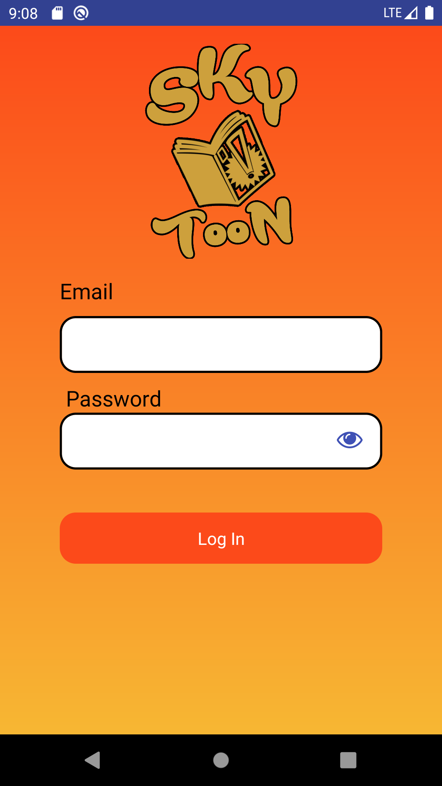
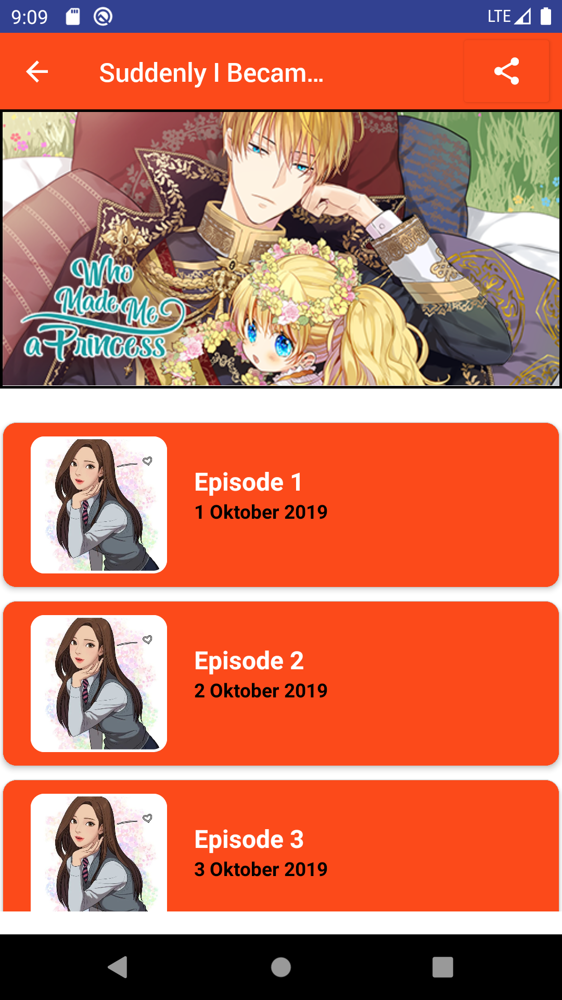
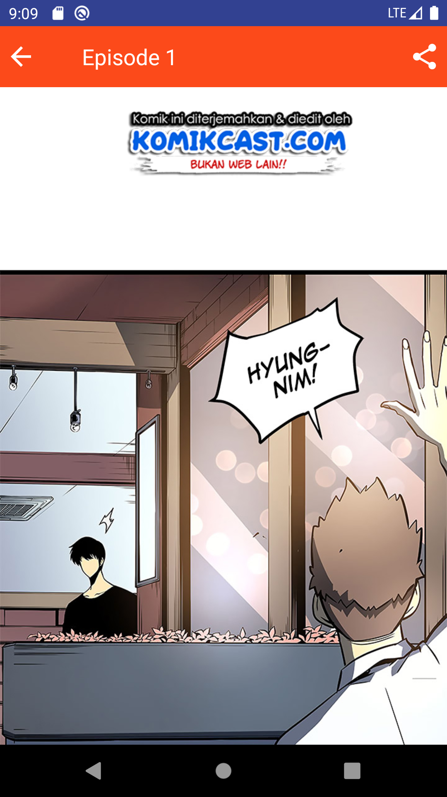
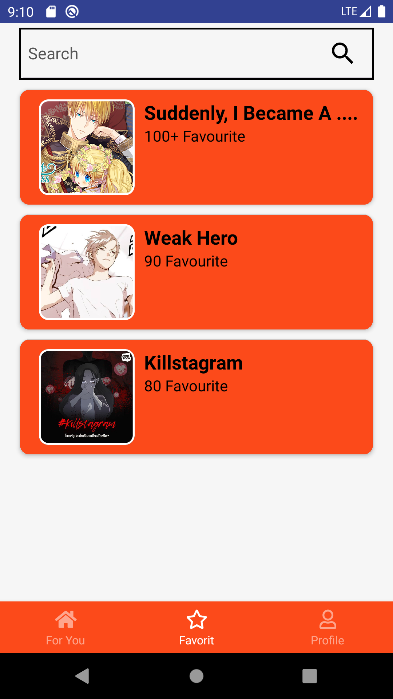
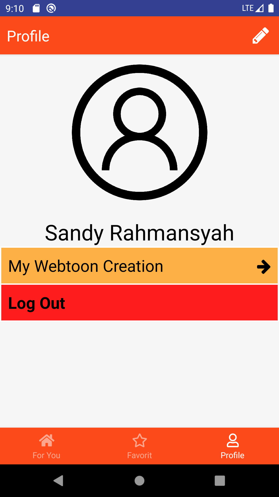
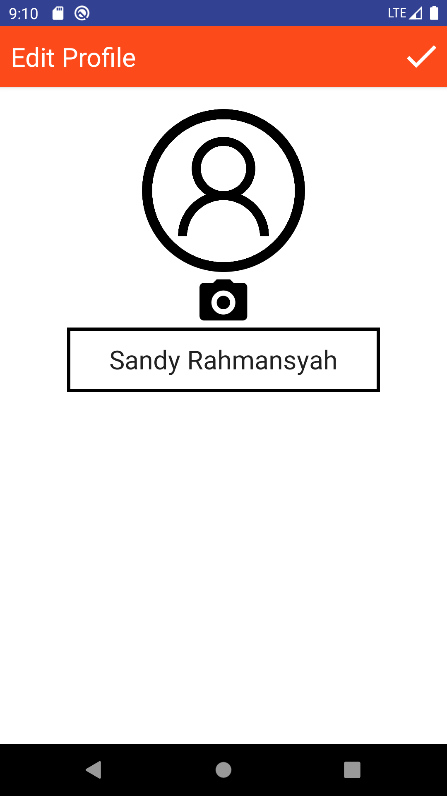
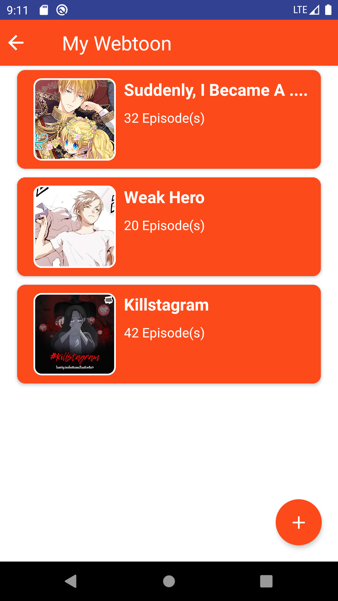
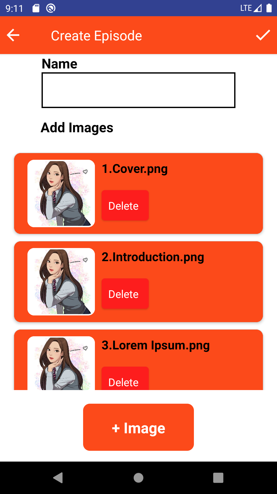
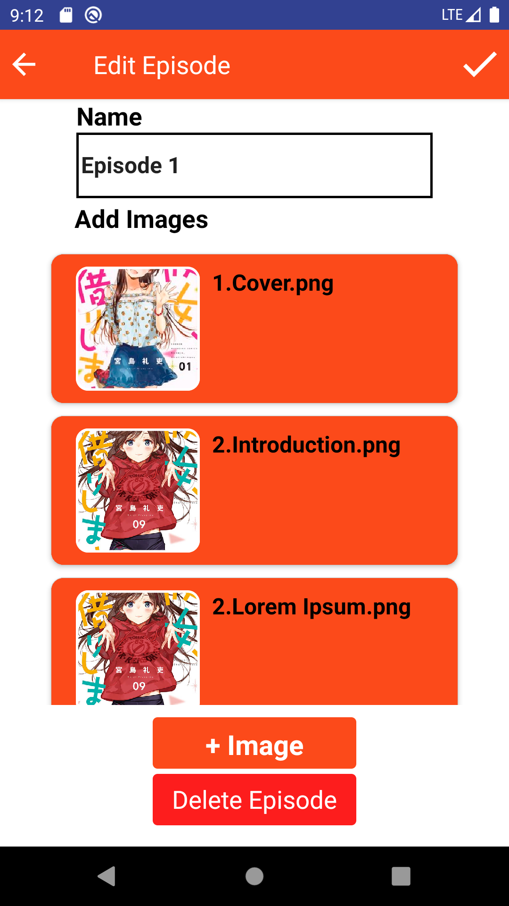

<h1 align="center">
  <br>
</h1>

## Important
This project is still on very early development stage. If you want to use for production, use it with your own risk.
<br>More feature Coming Really Soon.


## Screenshots

<p float="left">
  
  
  
  
  
  
  
  
  
  
  
  
</p>


## Features
* Read Comic Online
* Read Offline
* Search Comic
* Add favourite Comic

## Why SKY-TOON?
* 
* It's React Native, so it support android & iOS by default!
* Simple Code, so you can easily contribute on it.
* Meteor is one of the most starred javascript framework, and it is very easy to use

## Tech Stack
* React Native for the Mobile Frontend

## Prerequisites
* Make sure You had been install NodeJs in your system https://nodejs.org/
* Then install React Native https://facebook.github.io/react-native/

## Installation & Configuration
Follow these step to install

**Frontend:**
```
$ git clone https://github.com/DumbWaysStudent/DW12XN34J_webtoon/
$ npm install
$ react-native run-ios #for ios
$ react-native run-android #for android


## Support Me :)
* Star this repository :star:

## Contact 
* WA/TELEGRAM: +62 831 5344 0780
* email: sandy.adzim@gmail.com

----

## License

BSD 3-Clause License

See [LICENSE](LICENSE)
